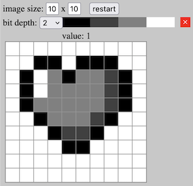

# Image Representation Gizmo

A simple toy to explore how images are stored digitally. This demonstration lets you play with bit depth to see how nuance is introduced with more bits of color resolution. 

Pick a shade from what's available at the selected bit depth, and click on a pixel to paint it!

The text display below the image shows a rudimentary text representation of the image. This is *one* possible way to represent the information of the image as text. As you hover over pixels in the image, the corresponding value will be highlighted in the text display.

by Mark Sherman